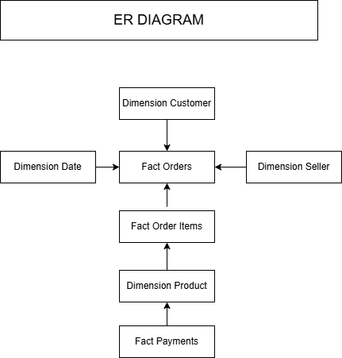

++++++++++++++++++++++++++++++++++++++

++++ Data Model Review

++++++++++++++++++++++++++++++++++++++

Document Information
====================

Item            Value
--------------------------
Project ::			E-Commerce Analytics

Author ::			Partha Basak

Version ::			1.0

Date ::			    30/06/2026

Business Problem
=================

The business requires a centralized analytics data warehouse to analyze revenue, customers, products, sellers, payments and delivery performance. The raw csv file can not be used for reporting due to normalization, inconsistance data.

Source Systems
=================

File format :: csv
Source of:: customers, orders, product, sellers, paayments, reviews, order items

Business Requirements
======================

The business should be able to answer

	- Monthly revenue
	- Revenue by product category
	- Revenuue by sellers
	- Top customers
	- Delivery delays
	- Repeat customers
	- Average purchase rate
	- Average order Value
	- Customer geography
	- Product category performance
	
Grain Definition
=====================

Table :: Fact orders
Grain  :: One row per order
	
Table :: Fact orders items
Grain  :: One row per product within an order	

Table :: Fact payments
Grain  :: One row per payment transaction

Table :: Dimension Customers
Grain  :: One row per customer

Table :: Dimension Product
Grain  :: One row per product

Table :: Dimension Seller
Grain  :: One row per seller

Star Schema
==============

ER Diagram

Fact Tables
============

Fact orders
-----------

Purpose: Stores order level business metrics

Columns
| Column          |    Description    |
|-----------------|-------------------|
| order_id        | Business Key      |
| customer_key    | FK                |
| date_key        | FK                |
| date_key        | FK                |
| delivery_days   | calculated        |
| delay_days      | calculated        |        
| total_order_valu| measured          |
| total_frieght   | measured          |
| total_payment   | measured          |

Measures: 
|---------------------------------|
| Total revenue                   |
| Average delivery days           |
| Completed delivery percentage   |
| Average delay days              |  
| Frieght                         |

Fact Order items
-----------------

Purpose: Supports product  and seller analysis

Measures: 
|---------------------------------|
| Product Price                   |
| Frieght Value                   |

Fact Payments
--------------

Purpose: Supports payment analysis

Measures: 
|----------------|
| Payment Value  |

Dimension Review
-----------------
Customer Dimension

Purpose : Stores customer descriptive attributes

Columns
	- customer_key(Primary Key)
	- customer_id(Business Key)
	- customer_unique_id
	- customer_city
	- customer_state

SCD : Type 1

Product Dimension
------------------

Purpose : Stores product metadata

Attributes : 	Category, Width, Lenght, Height, Weight

SCD : Type 1

Seller Dimension
-----------------

Purpose : Seller information

Date Dimension
---------------

Purpose : Supports time related details

Attributes : 	year, quarter, month, week, day, day_name

Relationships
-------------

| Fact            |    Dimension      |    Relationship   |
|-----------------|-------------------|-------------------|
| Fact Orders     |      Customer     |   Many to one     |
| Fact Orders     |       Date        |   Many to one     |
|Fact Orders Items|       Product     |   Many to one     |
|Fact Orders Items|       Seller      |   Many to one     |
|Fact Orders Items|       Date        |   Many to one     |
| Fact Payment    |       Date        |   Many to one     |        
| Fact Payment    |       Customer    |   Many to one     |        

Measures
---------
All possible Metrics

| Measure            |    Formula      |
|-----------------|-------------------|
|Revenue| sum(price)|
|Average Order Value| Revenue/Total Orders|
|Delivery Days|Delivered Date - Purchase Date|
|Delay Days|Delivered Date - Estimated Date|
|Repeat Customer Rate|Repeat Customers / Total Customers|
|Seller Contribution %|Seller Revenue / Total Revenue|
|Order Completion Rate|Delivered Orders / Total Orders|
|Product  Contribution %|product Revenue / Total Revenue|

