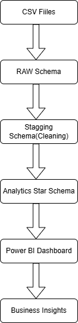

# Architecture

## Project Overview

This project implements an end-to-end analytics platform for the Brazilian Olist e-commerce dataset.

The objective is to transform raw CSV files into a dimensional data warehouse that supports business reporting and interactive Power BI dashboards.

Technology Stack

- SQL Server
- SQL
- Python (Pandas)
- Power BI
- GitHub

## Architecture Diagram

## Technology Stack

| Layer           | Technology   |
| --------------- | ------------ |
| Source          | CSV          |
| Database        | SQL Server   |
| Cleaning        | Python + SQL |
| Data Warehouse  | Star Schema  |
| Reporting       | Power BI     |
| Version Control | Git          |
| Documentation   | Markdown     |

## Source Layer

| Dataset   | Description        |
| --------- | ------------------ |
| Customers | Customer master    |
| Orders    | Order transactions |
| Products  | Product metadata   |
| Sellers   | Seller information |
| Payments  | Payment records    |
| Reviews   | Customer reviews   |
